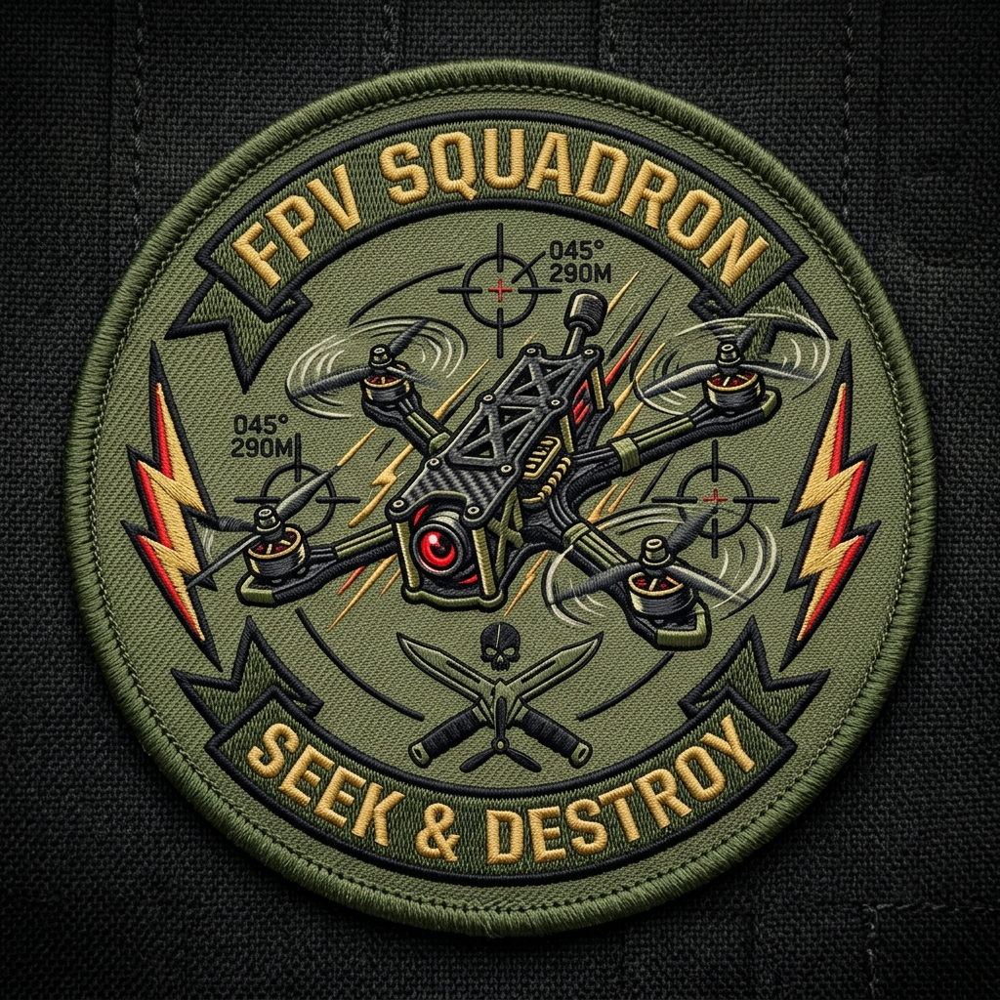
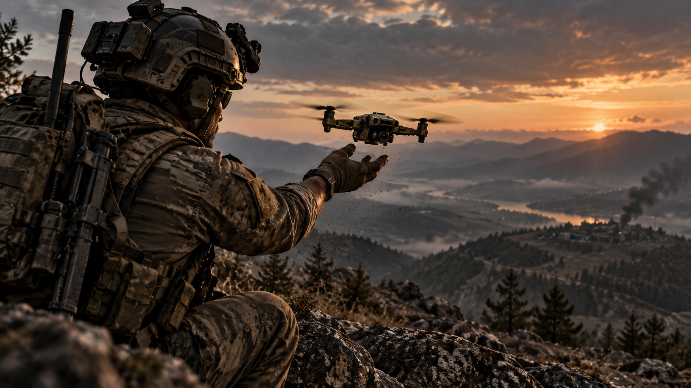

<p align="center">
  
  <br>
  <h1>⚡ FPV Strike Quadcopter Drone Mod for DCS World</h1>
</p>

<p align="center">
  <a href="https://www.digitalcombatsimulator.com/"></a>
  <a href="https://github.com/CrudeCoder1/DCS-FPV-Drone"></a>
  <a href="LICENSE"></a>
</p>

<p align="center">
  
</p>

An ultra-realistic, fully flyable **FPV Kamikaze Strike Quadcopter Drone** mod for DCS World. Modeled after combat FPV quadcopters, featuring custom External Flight Model (EFM) multirotor aerodynamics, analog video feed with authentic Betaflight OSD, anti-armor warhead payloads, and multi-vector impact detonation against tanks and fortified targets.

---

## 📑 Table of Contents
- [Key Features](#-key-features)
- [Flight Modes & Dynamics](#-flight-modes--dynamics)
- [Weapons & Detonation Mechanics](#-weapons--detonation-mechanics)
- [Flight Controls & Keybindings](#-flight-controls--keybindings)
- [OSD Telemetry Overview](#-osd-telemetry-overview)
- [Installation Guide](#-installation-guide)
- [Mission Editor & Special Options](#-mission-editor--special-options)
- [Changelog](#-changelog)
- [Credits & License](#-credits--license)

---

## 🎯 Key Features

* **Custom External Flight Model (EFM):** True quadcopter multirotor physics featuring independent motor thrust vectors, high-alpha agility, and realistic inertia.
* **Anti-Armor & Frag Payloads:**
  * **PG-7V "Morkva" Shaped Charge (HEAT):** Anti-armor cumulative warhead capable of penetrating main battle tanks (T-72/80/90, Abrams, Leopard), IFVs, and reinforced bunkers.
  * **Improvised Explosive (HE/Frag):** High-explosive fragmentation warhead for soft targets, artillery batteries, and infantry positions.
* **Autonomous Multi-Vector Impact Fuse:**
  * Auto-arms 1.5 seconds after takeoff once airspeed exceeds 2.5 m/s.
  * Detonates on sudden deceleration spikes (hitting vehicle hulls, walls, trench lines).
  * Detonates on high-G shock impacts (> 30G) or high-speed ground strikes.
  * Manual command detonation available at any time via `[Space Bar]`.
* **Authentic FPV Video Transmission:**
  * Analog CRT scanline overlay effect.
  * Instant signal cutout to static noise upon airframe destruction or battery exhaustion.
  * Betaflight glyph-based OSD with live cell/pack voltage, throttle position, and stick inputs.
* **Flexible Piloting:** Full support for Keyboard, Gamepad (Xbox/PlayStation), and HOTAS controllers with smooth rate damping and auto-hover presets.

---

## 🕹️ Flight Modes & Dynamics

The drone automatically arms on spawn in self-leveling Angle mode:

| Mode | Key | Description |
| :--- | :---: | :--- |
| **Angle Mode** | `[2]` | **Self-Leveling Mode (Default).** Stick/key deflection commands a tilt angle up to the configured limit (default 50°). Returning stick to center levels the drone. Perfect for precision target approaches. |
| **Acro Mode** | `[1]` | **Rate Mode.** Stick/key deflection directly controls angular rotation rate in pitch, roll, and yaw without self-leveling (identical to Betaflight freestyle/racing modes). |
| **Arm / Disarm** | `[A]` | Toggles motor arming. Drone will not produce motor thrust when disarmed. |
| **Auto-Hover** | `[H]` | Automatically locks throttle to 55% hover power for hands-free altitude holding. |
| **Throttle Cut** | `[C]` | Instantly cuts throttle to 0% for emergency stops or perching. |

---

## 💣 Weapons & Detonation Mechanics

### Available Loadouts (Pylon 1 in Mission Editor / Ground Rearm)
1. **`{FPV_PG7V_Morkva}` - PG-7V "Morkva" HEAT Shaped Charge:**
   * 2.2 kg warhead with dedicated 3D rocket model (`FPV_Morkovka.edm`).
   * High-velocity cumulative jet with 400mm+ RHA penetration against tank roofs, engine bays, and tracks.
2. **`{DroneBomb}` - Improvised Explosive (HE/Frag):**
   * 1.0 kg anti-personnel fragmentation explosive.

### Detonation Triggers
- **Kinetic Deceleration Spike:** Triggered automatically when speed abruptly drops by > 2.0 m/s at velocity > 3.0 m/s (slamming into a vehicle or structure).
- **Extreme G-Shock:** Triggered when impact deceleration exceeds ~30G.
- **Low-Altitude Velocity Strike:** Triggered on ground/structure contact at altitude < 0.60m and speed > 3.0 m/s.
- **Manual Command Detonation:** Instant detonation by pressing **`[Space Bar]`**.
- **Master Arm Safety:** Warhead can be disarmed/re-armed in flight using **`[Y]`** (indicated by OSD `WHD: ARM` / `WHD: SAFE`).

---

## ⌨️ Flight Controls & Keybindings

### Keyboard Controls
| Action | Key | Category |
| :--- | :---: | :--- |
| **Arm / Disarm Motors** | `[A]` | Flight Control |
| **Flight Mode - Acro** | `[1]` | Flight Control |
| **Flight Mode - Angle (Auto-Level)** | `[2]` | Flight Control |
| **Manual Detonate Warhead** | `[Space]` | Weapons |
| **Toggle Warhead Master Arm** | `[Y]` | Weapons |
| **Throttle Up (Climb)** | `[PageUp]` / `[W]` | Flight Control |
| **Throttle Down (Descend)** | `[PageDown]` / `[S]` | Flight Control |
| **Auto-Hover Lock Preset** | `[H]` | Flight Control |
| **Throttle Cut (0%)** | `[C]` | Flight Control |
| **Pitch Forward (Tilt Down)** | `[Up Arrow]` | Flight Control |
| **Pitch Backward (Tilt Up)** | `[Down Arrow]` | Flight Control |
| **Roll Bank Left** | `[Left Arrow]` | Flight Control |
| **Roll Bank Right** | `[Right Arrow]` | Flight Control |
| **Yaw Rotate Left** | `[Q]` / `[Z]` | Flight Control |
| **Yaw Rotate Right** | `[E]` / `[X]` | Flight Control |

### Gamepad / Xbox Controller
| Action | Button / Axis |
| :--- | :--- |
| **Pitch / Roll** | Left Stick (X/Y) |
| **Yaw (Rudder)** | Right Stick (X) |
| **Throttle** | Left Trigger / Stick |
| **Arm / Disarm** | Button `[A]` (`JOY_BTN1`) |
| **Angle Mode** | Button `[B]` (`JOY_BTN2`) or `[D-Pad Up]` |
| **Acro Mode** | Button `[X]` (`JOY_BTN3`) or `[D-Pad Down]` |
| **Detonate Weapon** | Button `[RB]` (`JOY_BTN6`) or `[LB]` (`JOY_BTN5`) |
| **Toggle Warhead Arm** | Button `[Y]` (`JOY_BTN4`) |

---

## 📺 OSD Telemetry Overview

The onboard head-up display provides real-time Betaflight-style telemetry:
* **Top Left:** Battery pack voltage (`%.1fv`), single cell voltage (`%.1fv`), and remaining charge (`%`).
* **Top Right:** Active flight mode (`ACRO` / `ANGL`).
* **Upper Center:** Warhead master arm status (`WHD: ARMED` / `WHD: SAFE`).
* **Center Reticle:** Crosshair targeting reticle for precision nose-in strikes.
* **Bottom:** Real-time visual stick deflection indicators (throttle/yaw on left, pitch/roll on right).
* **Center Warning:** Displays `DISARMED` in red when safety is engaged.

---

## 📥 Installation Guide

1. Download or clone this repository.
2. Place the `FPV_Drone` folder into your DCS Saved Games directory:
   ```text
   C:\Users\<YourUsername>\Saved Games\DCS\Mods\aircraft\FPV_Drone
   ```
   *(For DCS OpenBeta: `Saved Games\DCS.openbeta\Mods\aircraft\FPV_Drone`)*
3. Launch DCS World. The **FPV Drone** icon will appear on the main menu module bar.

---

## ⚙️ Mission Editor & Special Options

* **Role:** Listed under **Helicopters** as **`FPV Drone`** (`Ground Attack`, `AFAC`, `Reconnaissance`).
* **Liveries:** Choose between `Standard`, `Blackout`, `RedProps`, `GreenProps`, and `BlueProps`.
* **Special Settings (Options -> Special -> FPV Drone):**
  * `maxYawRate`: Adjust peak yaw angular speed (20–400 deg/s).
  * `maxPitchRollRate`: Adjust peak acro flip rate (20–500 deg/s).
  * `maxAngle`: Max self-leveling tilt angle in Angle mode (10–60°).
  * `gravity`: Tune gravity multiplier for custom aerodynamics.
  * `scanLineEffect`: Checkbox to toggle CRT analog scanlines on/off.

---

## 📜 Changelog

### v0.9.2
* Added **PG-7V "Morkva" HEAT shaped charge** warhead with 400mm+ RHA penetration.
* Implemented autonomous multi-vector impact detonation (kinetic deceleration, G-shock, ground strikes).
* Added smooth keyboard throttle accumulator with auto-hover preset `[H]` and throttle cut `[C]`.
* Added analog video cutout static snow on detonation and airframe destruction.
* Added gamepad and joystick presets with native controller mappings.

### v0.9.1
* Adjusted ground collision and gear spring damping.
* Added crosshairs and analog CRT scanline effect with options menu toggle.
* Migrated font to authentic Betaflight glyphs.
* Fixed VR camera centering.

### v0.9.0
* Initial release.

---

## 👥 Credits & License

* Developed by **CrudeCoder1** & contributors.
* OSD Glyphs from Betaflight (under GPLv3).
* Licensed under the [GNU General Public License v3.0](LICENSE).
